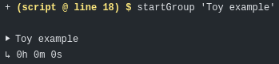
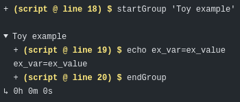
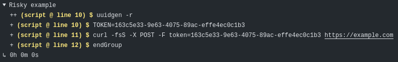

# Docker-Coq GitHub Action

[![reviewdog][reviewdog-badge]][reviewdog-link]
[![Docker-Coq CI][docker-coq-ci-badge]][docker-coq-ci-link]
[![Docker-based CI][python-ci-badge]][python-ci-link]
[![Regression Test][rt-ci-badge]][rt-ci-link]  
[![coqorg][coqorg-shield]][coqorg-link]
[![mathcomp][mathcomp-shield]][mathcomp-link]
[![Example][example-shield]][example-link]
[![Contributing][contributing-shield]][contributing-link]
[![Code of Conduct][conduct-shield]][conduct-link]

[reviewdog-badge]: https://github.com/coq-community/docker-coq-action/actions/workflows/reviewdog.yml/badge.svg?branch=master
[docker-coq-ci-badge]: https://github.com/coq-community/docker-coq-action/actions/workflows/coq-demo.yml/badge.svg?branch=master
[python-ci-badge]: https://github.com/coq-community/docker-coq-action/actions/workflows/python-demo.yml/badge.svg?branch=master
[rt-ci-badge]: https://github.com/coq-community/docker-coq-action/actions/workflows/gha-rt.yml/badge.svg?branch=master
[reviewdog-link]:https://github.com/coq-community/docker-coq-action/actions/workflows/reviewdog.yml
[docker-coq-ci-link]:https://github.com/coq-community/docker-coq-action/actions/workflows/coq-demo.yml
[python-ci-link]:https://github.com/coq-community/docker-coq-action/actions/workflows/python-demo.yml
[rt-ci-link]:https://github.com/coq-community/docker-coq-action/actions/workflows/gha-rt.yml

[coqorg-shield]: https://img.shields.io/badge/depends%20on-coqorg%2Fcoq-blue.svg
[coqorg-link]: https://hub.docker.com/r/coqorg/coq

[mathcomp-shield]: https://img.shields.io/badge/see%20also-mathcomp%2Fmathcomp-blue.svg
[mathcomp-link]: https://hub.docker.com/r/mathcomp/mathcomp

[example-shield]: https://img.shields.io/badge/see%20also-example-brightgreen.svg
[example-link]: https://github.com/erikmd/docker-coq-github-action-demo

[contributing-shield]: https://img.shields.io/badge/contributions-welcome-%23f7931e.svg
[contributing-link]: https://github.com/coq-community/manifesto/blob/master/CONTRIBUTING.md

[conduct-shield]: https://img.shields.io/badge/%E2%9D%A4-code%20of%20conduct-%23f15a24.svg
[conduct-link]: https://github.com/coq-community/manifesto/blob/master/CODE_OF_CONDUCT.md

This is a GitHub Action that uses (by default)
[coqorg/coq](https://hub.docker.com/r/coqorg/coq/) Docker images,
which in turn is based on [coqorg/base](https://hub.docker.com/r/coqorg/base/),
a Docker image with a Debian environment.

|   | GitHub repo                                                             | Type          | Docker Hub                                             |
|---|-------------------------------------------------------------------------|---------------|--------------------------------------------------------|
| ⊙ | [docker-coq-action](https://github.com/coq-community/docker-coq-action) | GitHub Action | N/A                                                    |
| ↳ | [docker-coq](https://github.com/coq-community/docker-coq)               | Dockerfile    | [`coqorg/coq`](https://hub.docker.com/r/coqorg/coq/)   |
| ↳ | [docker-base](https://github.com/coq-community/docker-base)             | Dockerfile    | [`coqorg/base`](https://hub.docker.com/r/coqorg/base/) |
| ↳ | Debian                                                                  | Linux distro  | [`debian`](https://hub.docker.com/_/debian/)           |

For more details about these images, see the
[docker-coq wiki](https://github.com/coq-community/docker-coq/wiki).

## OPAM

The `docker-coq-action` provides built-in support for `opam` builds.

`coq` is built on-top of `ocaml` and so `coq` projects use `ocaml`'s
package manager (`opam`) to build themselves.
This GitHub Action supports `opam` out of the box.
If your project does not already have a `coq-….opam` file, you might
generate one such file by using the corresponding template gathered in
[coq-community/templates](https://github.com/coq-community/templates#readme).

This `.opam` file can then serve as a basis for submitting releases in
[coq/opam-coq-archive](https://github.com/coq/opam-coq-archive), and
related guidelines (including the required **`.opam` metadata**) are
available in <https://coq.inria.fr/opam-packaging.html>.

More details can be found in the
[opam documentation](https://opam.ocaml.org/doc/Packaging.html#The-file-format-in-more-detail).

Assuming the Git repository contains a `folder/coq-proj.opam` file,
it will run (by default) the following commands:

```bash
opam config list; opam repo list; opam list
sudo apt-get update -y -q
opam pin add -n -y -k path coq-proj folder
opam update -y
opam install --confirm-level=unsafe-yes -j 2 coq-proj --deps-only
opam list
opam install -y -v -j 2 coq-proj
opam list
opam remove coq-proj
```

The `apt-get` command and the `--confirm-level=unsafe-yes` opam option
are necessary for automatic installation of system packages
that may be required by `coq-proj.opam`, as described in the
[opam 2.1 release notes](https://opam.ocaml.org/blog/opam-2-1-0/#Seamless-integration-of-System-dependencies-handling-a-k-a-quot-depexts-quot).

## Using the GitHub Action

Using a [GitHub Action](https://docs.github.com/en/actions)
in your GitHub repository amounts to committing a file `.github/workflows/your-workflow-name.yml`,
e.g. `.github/workflows/build.yml`, containing (among others), a snippet such as:

```yaml
runs-on: ubuntu-latest  # container actions require GNU/Linux
strategy:
  matrix:
    coq_version:
      - '8.16'
      - dev
    ocaml_version: ['default']
  fail-fast: false  # don't stop jobs if one fails
steps:
  - uses: actions/checkout@v3
  - uses: coq-community/docker-coq-action@v1
    with:
      opam_file: 'folder/coq-proj.opam'
      coq_version: ${{ matrix.coq_version }}
      ocaml_version: ${{ matrix.ocaml_version }}
```

Each field can be customized, see below
for the documentation of those specific to the docker-coq-action,
or the GitHub Actions official documentation for the
[standard fields involved in workflows](https://docs.github.com/en/actions/reference/workflow-syntax-for-github-actions).

### References

For details, see also:

* the [action.yml](./action.yml) file (containing the metadata processed by the GitHub Actions platform itself, as well as some comments, albeit more terse than the [documentation below](#inputs));
* the accompanying [`coq-demo` example repo](https://github.com/erikmd/docker-coq-github-action-demo);
* the two workflows [coq-demo.yml](./.github/workflows/coq-demo.yml) and [python-demo.yml](./.github/workflows/python-demo.yml) that both serve as `docker-coq-action`'s CI test-suite and provide some examples of use.

### Versioning

The Git repo of `docker-coq-action` uses `master` as developing branch
and `v1` as release branch; and the corresponding tags `v1.x.y` follow
[semantic versioning](https://semver.org/).

We develop `docker-coq-action` with a special focus on backward
compatibility, so that if your workflow just uses
**`coq-community/docker-coq-action@v1`**, you will be able to benefit
from new features, while expecting no breaking change.

However, we recall that the version of any GitHub Action can just as
well be [referenced by a tag or a commit SHA](https://docs.github.com/en/actions/learn-github-actions/finding-and-customizing-actions#using-release-management-for-your-custom-actions).

Contrary to some custom practice of GitHub Actions maintainers, we do not change to which commit a tag points once it is published.
As a result, the latest stable version denoted by the short Git reference `v1` is implemented as a *release branch*, not as a tag.
Anyway, if you do not trust the maintainers of a given GitHub Action, it is always safer to reference a *commit SHA*.

### Inputs

#### `opam_file`

*Optional*

The path of the `.opam` file (or a directory), relative to the repo root.

Default: `"."` (if the argument is omitted or an empty string).

*Note-1:* relying on the value of this `INPUT_OPAM_FILE` variable, the
following two variables are exported when running the `custom_script`:

```bash
if [ -z "$INPUT_OPAM_FILE" ] || [ -d "$INPUT_OPAM_FILE" ]; then
    WORKDIR=""
    PACKAGE=${INPUT_OPAM_FILE:-.}
else
    WORKDIR=$(dirname "$INPUT_OPAM_FILE")
    PACKAGE=$(basename "$INPUT_OPAM_FILE" .opam)
fi
```

*Note-2:* if this value is a directory (e.g., `.`), relying on the
[`custom_script` default value](#custom_script), the action will
install all the `*.opam` packages stored in this directory.

#### `coq_version`

*Optional*

The version of Coq. E.g., `"8.10"`.

Default: `"latest"` (= latest stable version).

Append the `-native` suffix if the version is `>= 8.13` (or `dev`)
*and* you are interested in the image that contains the
[`coq-native`](https://opam.ocaml.org/packages/coq-native/) package.
E.g., `"8.13-native"`, `"latest-native"`, `"dev-native"`.

If the `coq_version` value contains the `-native` suffix,
the `ocaml_version` value is ignored (as `coq-native` images only come with a single OCaml version).
Still, a warning is raised if `ocaml_version` is nonempty and different from `"default"`.

#### `ocaml_version`

*Optional*

The version of OCaml.

Default: `"default"` (= Docker-Coq's default OCaml version for the given Coq version).

Among `"default"`, `"4.02"`, `"4.05"`, `"4.07-flambda"`, `"4.08-flambda"`, `"4.09-flambda"`, `"4.10-flambda"`, `"4.11-flambda"`, `"4.12-flambda"`, `"4.13-flambda"`, `"4.14-flambda"`…

**Warning!** not all OCaml versions are available with all Coq versions.

The supported compilers w.r.t. each version of Coq are documented in the
[OCaml-versions policy](https://github.com/coq-community/docker-coq/wiki#ocaml-versions-policy) section of the `docker-coq` wiki.

#### `before_install`

*Optional*

The bash snippet to run before `install`

Default:

```bash
startGroup "Print opam config"
  opam config list; opam repo list; opam list
endGroup
```

See [`custom_script`](#custom_script) and [startGroup/endGroup](#startGroupendGroup) for more details.

#### `install`

*Optional*

The bash snippet to install the `opam` `PACKAGE` dependencies.

Default:

```bash
startGroup "Install dependencies"
  sudo apt-get update -y -q
  opam pin add -n -y -k path $PACKAGE $WORKDIR
  opam update -y
  opam install --confirm-level=unsafe-yes -j 2 $PACKAGE --deps-only
endGroup
```

where `$PACKAGE` and `$WORKDIR` are set from the [`opam_file`](#opam_file) variable.

See [`custom_script`](#custom_script) and [startGroup/endGroup](#startGroupendGroup) for more details.

#### `after_install`

*Optional*

The bash snippet to run after `install` (if successful).

Default:

```bash
startGroup "List installed packages"
  opam list
endGroup
```

See [`custom_script`](#custom_script) and [startGroup/endGroup](#startGroupendGroup) for more details.

#### `before_script`

*Optional*

The bash snippet to run before `script`.

Default: `""` (empty string).

See [`custom_script`](#custom_script) and [startGroup/endGroup](#startGroupendGroup) for more details.

#### `script`

*Optional*

The bash snippet to install the `opam` `PACKAGE`.

Default:

```bash
startGroup "Build"
  opam install -y -v -j 2 $PACKAGE
  opam list
endGroup
```

where `$PACKAGE` is set from the [`opam_file`](#opam_file) variable.

See [`custom_script`](#custom_script) and [startGroup/endGroup](#startGroupendGroup) for more details.

#### `after_script`

*Optional*

The bash snippet to run after `script` (if successful).

Default: `""` (empty string).

See [`custom_script`](#custom_script) and [startGroup/endGroup](#startGroupendGroup) for more details.

#### `uninstall`

*Optional*

The bash snippet to uninstall the `opam` `PACKAGE`.

Default:

```bash
startGroup "Uninstallation test"
  opam remove $PACKAGE
endGroup
```

where `$PACKAGE` is set from the [`opam_file`](#opam_file) variable.

See [`custom_script`](#custom_script) and [startGroup/endGroup](#startGroupendGroup) for more details.

#### `custom_script`

*Optional*

The main script run in the container; may be overridden; but overriding more specific parts of the script is preferred.

Default:

```
{{before_install}}
{{install}}
{{after_install}}
{{before_script}}
{{script}}
{{after_script}}
{{uninstall}}
```

*Note-1:* the semantics of this variable is a *standard Bash script*,
that is evaluated within the workflow container after replacing the
"mustache" placeholders with the value of their variable counterpart.
For example, `{{uninstall}}` will be replaced with the value of the
[`uninstall`](#uninstall) variable (the default value of which being
the string `opam remove $PACKAGE`).

*Note-2:* this option is named `custom_script` rather than `run` or so
to **discourage changing its recommended, default value** for building
a regular `opam` project, while keeping the flexibility to be able to
change it.

*Note-3:* if you decide to override the `custom_script` value anyway,
you can just as well rely on the "mustache interpolation" of
`{{before_install}}` … `{{uninstall}}`, and customize the underlying
values.

#### `custom_image`

*Optional*

The name of the Docker image to pull.

Default: unset

If this variable is unset, its value is computed from the values of
keywords `coq_version` and `ocaml_version`.

If you use the standard
[`docker-coq`](https://github.com/coq-community/docker-coq) images, we
recommend to directly use keywords `coq_version` and `ocaml_version`.

If you use another registry such as that of
[`docker-mathcomp`](https://github.com/math-comp/docker-mathcomp)
images, you can benefit from that keyword by writing a configuration
such as:

```yaml
runs-on: ubuntu-latest
strategy:
  matrix:
    image:
      - mathcomp/mathcomp:1.10.0-coq-8.10
      - mathcomp/mathcomp:1.10.0-coq-8.11
      - mathcomp/mathcomp:1.11.0-coq-dev
      - mathcomp/mathcomp-dev:coq-dev
  fail-fast: false  # don't stop jobs if one fails
steps:
  - uses: actions/checkout@v3
  - uses: coq-community/docker-coq-action@v1
    with:
      opam_file: 'folder/coq-proj.opam'
      custom_image: ${{ matrix.image }}
```

#### `export`

*Optional*

A space-separated list of `env` variables to export to the `custom_script`.

Default: `""`, i.e., no additional variable is exported.

*Note-1:* The values of the variables to export may be defined by using the
[`env`](https://docs.github.com/en/actions/reference/environment-variables)
keyword.

*Note-2:* Regarding the naming of these variables:

* Only use ASCII letters, `_` and digits, i.e., matching the `[a-zA-Z_][a-zA-Z0-9_]*` regexp.
* Avoid [reserved identifiers](https://docs.github.com/en/actions/reference/environment-variables#default-environment-variables) (namely: `HOME`, `CI`, and strings starting with `GITHUB_`, `ACTIONS_`, `RUNNER_`, or `INPUT_`).

Here is a minimal working example of this feature:

```yaml
runs-on: ubuntu-latest
steps:
  - uses: actions/checkout@v3
  - uses: coq-community/docker-coq-action@v1
    with:
      opam_file: 'folder/coq-proj.opam'
      coq_version: 'dev'
      ocaml_version: 'default'
      export: 'OPAMWITHTEST'  # space-separated list of variables
    env:
      OPAMWITHTEST: 'true'
```

Here, setting the [`OPAMWITHTEST`](https://opam.ocaml.org/doc/man/opam-install.html#lbAG)
environment variable is useful to run the unit tests
(specified using `opam`'s [`with-test`](https://opam.ocaml.org/doc/Manual.html#pkgvar-with-test)
clause) after the package build.

## Remarks

### startGroup/endGroup

The default value of fields `{{before_install}}`, `{{install}}`,
`{{after_install}}`, `{{script}}`, and `{{uninstall}}` involves the bash
functions `startGroup` (taking 1 argument: `startGroup "Group title"`)
and `endGroup`.

These bash functions are defined in [timegroup.sh](./timegroup.sh) and have the following features:

* they create foldable groups in the GitHub Actions logs
    (see the [online doc](https://github.com/actions/toolkit/blob/master/docs/commands.md#group-and-ungroup-log-lines)),
* and they compute the elapsed time for the considered group;
* these groups cannot be nested,
* and if an `endGroup` has been forgotten, it is implicitly and
  automatically inserted at the next `startGroup` (albeit it is better
  to make each `endGroup` explicit, for readability).

Here is an example of script along with the output log so obtained:

```bash
ex_var="ex_value"
# […]

startGroup "Toy example"
  echo "ex_var=$ex_var"
endGroup
```

* Folded version:

  [](./images/2021-08-11_ex_log_folded.png)

* Unfolded version:

  [](./images/2021-08-11_ex_log_unfolded.png)

### Pitfall: do not use `&&`; use semicolons

Beware that the following script is *buggy*:

```yaml
script: |
  startGroup "Build project"
    make -j2 && make test && make install
  endGroup
```

Because if `make test` fails, it won't make the CI fail.

<details><summary><b>(Explanation)</b></summary>

This is a typical pitfall that occur *in any shell-based CI platform*
where the [`set -e`](
https://manpages.ubuntu.com/manpages/hirsute/en/man1/set.1posix.html#description)
option is implied: the early-exit associated to this option is
disabled if the failing command is followed by `&&` or `||`.

See e.g., the output of the following three commands:

```bash
bash -c 'set -e; false && true; echo $?; echo this should not be run'
# → 1
# → this should not be run

bash -c 'set -e; false; true; echo $?; echo this should not be run'
# (no output)

bash -c 'set -e; ( false && true ); echo $?; echo this should not be run'
# (no output)
```

</details>

Instead, you should write one of the following variants:

* using semicolons:

  ```yaml
  script: |
    startGroup "Build project"
      make -j2 ; make test ; make install
    endGroup
  ```

* using newlines:

  ```yaml
  script: |
    startGroup "Build project"
      make -j2
	  make test
	  make install
    endGroup
  ```

* using `&&` but within a subshell:

  ```yaml
  script: |
    startGroup "Build project"
      ( make -j2 && make test && make install )
    endGroup
  ```

### Permissions

If you use the
[`docker-coq`](https://github.com/coq-community/docker-coq) images,
the container user has UID=GID=1000 while the GitHub Actions workdir
has (UID=1001, GID=116).
This is not an issue when relying on `opam` to build the Coq project.
Otherwise, you may want to use `sudo` in the container to change the
permissions. You may also install additional Debian packages
(see the [dedicated section below](#install-debian-packages)).

Typically, this would lead to a workflow specification like this:

```yaml
runs-on: ubuntu-latest
strategy:
  matrix:
    image:
      - 'coqorg/coq:dev'
  fail-fast: false  # don't stop jobs if one fails
steps:
  - uses: actions/checkout@v3
  - uses: coq-community/docker-coq-action@v1
    with:
      opam_file: 'folder/coq-proj.opam'
      custom_image: ${{ matrix.image }}
      before_script: |
        startGroup "Workaround permission issue"
          sudo chown -R coq:coq .  # <--
        endGroup
      script: |
        startGroup "Build project"
          make -j2
        endGroup
      uninstall: |
        startGroup "Clean project"
          make clean
        endGroup
  - name: Revert permissions
    # to avoid a warning at cleanup time
    if: ${{ always() }}
    run: sudo chown -R 1001:116 .  # <--
```

For more details, see the
[CI setup / Remarks](https://github.com/coq-community/docker-coq/wiki/CI-setup#remarks)
section in the `docker-coq` wiki.

### Artifacts

The `docker-coq-action` and its "child" Docker image (specified by the
[`custom_image`](#custom_image) field) run inside a container, which
implies the associated filesystem is isolated from the runner.

However, the GitHub workspace directory is made available in the
container (using a so-called bind-mount) and set as the current
working directory.

As a result:

* all the files installed outside of this GitHub workspace directory
  (such as `opam` packages installed in `/home/coq/.opam`) are "lost"
  when `docker-coq-action` terminates;
* all the files put in the GitHub workspace directory (or in a
  sub-directory) are kept;  
  so it is possible to create artifacts, then use an action such as
  [`actions/upload-artifact@v2`](https://github.com/actions/upload-artifact)
  in a subsequent step.

Here is an example job for this use case, which also takes into
account the previously-mentioned [permissions workaround](#permissions):

```yaml
runs-on: ubuntu-latest
strategy:
  matrix:
    image:
      - 'coqorg/coq:dev'
  fail-fast: false  # don't stop jobs if one fails
    steps:
      - uses: coq-community/docker-coq-action@v1
        with:
          opam_file: 'folder/coq-proj.opam'
          custom_image: ${{ matrix.image }}
          before_script: |
            startGroup "Workaround permission issue"
              sudo chown -R coq:coq .
            endGroup
          script: |
            startGroup "Build project"
              coq_makefile -f _CoqProject -o Makefile
              make -j2
            endGroup
          after_script: |
            set -o pipefail  # recommended if the script uses pipes

            startGroup "Build artifacts"
              mkdir -v -p artifacts
              opam list > artifacts/opam_list.txt
              make test 2>&1 | tee artifacts/make_test.txt
            endGroup
          uninstall: ''
      - name: Revert permissions
        # to avoid a warning at cleanup time
        if: ${{ always() }}
        run: sudo chown -R 1001:116 .
      - uses: actions/upload-artifact@v2
        with:
          name: example-artifact
          path: artifacts/
          if-no-files-found: error  # 'warn' or 'ignore' are also available, defaults to `warn`
          retention-days: 8
```

### Install Debian packages

If you use `docker-coq-action` with a
[Docker-Coq](https://github.com/coq-community/docker-coq) image (the
default when the [`custom_image`](#custom_image) field is omitted),
the image is based on Debian stable and the container user
(UID=GID=1000) has `sudo` rights, so you can rely on `apt-get` to
install additional Debian packages.

This use case is illustrated by the following job that installs
the `emacs` and `tree` packages:

```yaml
runs-on: ubuntu-latest
strategy:
  matrix:
    image:
      - 'coqorg/coq:dev'
  fail-fast: false  # don't stop jobs if one fails
steps:
  - uses: actions/checkout@v3
  - uses: coq-community/docker-coq-action@v1
    with:
      opam_file: 'folder/coq-proj.opam'
      custom_image: ${{ matrix.image }}
      before_script: |
        startGroup "Install APT dependencies"
          cat /etc/os-release  # Print the Debian OS version
          # sudo apt-get update -y -q # this mandatory command is already run in install step by default
          sudo DEBIAN_FRONTEND=noninteractive apt-get install -y -q --no-install-recommends \
            emacs \
            tree  # for instance
            # Alphabetical order is recommended for long package lists to ease review and update
        endGroup
      after_script: |
        startGroup "Post-test"
          emacs --version
          tree
        endGroup
```

### Verbose output and Variable leaking

The code run in the `docker-coq-action` container relies on the
following invocation to display a customized prompt before each
command:

```bash
export PS4='+ \e[33;1m($0 @ line $LINENO) \$\e[0m '; set -ex
```

As a result, due to the `set -x` option, the value of each variable is
exposed in the log.

For example, the script:

```bash
startGroup "Risky example"
  TOKEN=$(uuidgen -r)
  curl -fsS -X POST -F token="$TOKEN" https://example.com >/dev/null
endGroup
```

will produce a log such as:

[](./images/2021-08-11_too_verbose_log.png)

Hence the following two remarks:

1. If need be, it is possible to temporarily disable the trace feature
   in your script, surrounding the lines at stake by (`set +x`, `set -x`).  
   Your script would thus look like:

   ```bash
   set +x

   #...some code with no trace...

   set -x
   ```

   or, to get some even less verbose output:

   ```bash
   { set +x; } 2>/dev/null

   #...some code with no trace...

   set -x
   ```

2. Fortunately, this trace feature cannot make repository secrets
   `${{ secrets.STH }}` leak, as
   [GitHub Actions automatically redact them in the log](https://docs.github.com/en/actions/reference/encrypted-secrets#accessing-your-secrets).  
   Regarding secrets obtained by other means, e.g. from a command-line
   program, it is recommended to perform the three actions below **in a
   previous `run:` step**:

   * store the "locally-created secret" in an environment variable:

     ```bash
     SOME_TOKEN="..."
     ```

   * immediately [mark the variable as masked](https://docs.github.com/en/actions/reference/workflow-commands-for-github-actions#masking-a-value-in-log):

     ```bash
     echo "::add-mask::$SOME_TOKEN"
     ```

   * register the variable to [make it available for subsequent steps](https://docs.github.com/en/actions/reference/workflow-commands-for-github-actions#setting-an-environment-variable):

     ```bash
     printf "%s\n" "SOME_TOKEN=$(printf "%q" "$SOME_TOKEN")" >> $GITHUB_ENV
     ```

   A comprehensive example of this approach is available in PR [erikmd/docker-coq-github-action-demo#12](https://github.com/erikmd/docker-coq-github-action-demo/pull/12).

   For completeness, note that masking inputs involved in `workflow_dispatch` may require some `jq`-based workaround, as mentioned in issue [actions/runner#643](https://github.com/actions/runner/issues/643).
